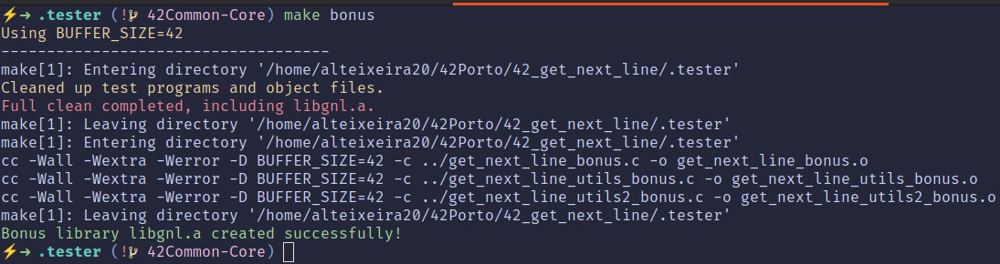
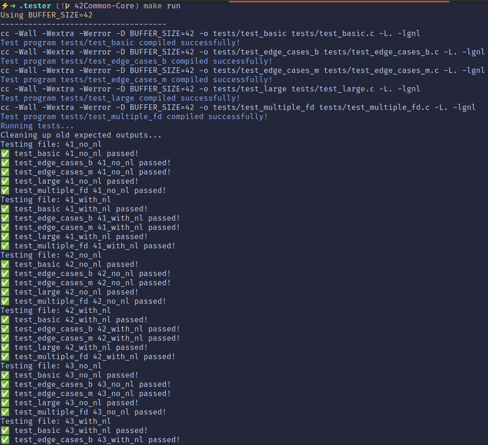

<h1 align="center">get_next_line</h1>
<p align="center"><em>Autonomous, static-aware line streaming with a tester-first mindset.</em></p>

<p align="center">
  <a href="#about">About</a> ·
  <a href="#custom-tester">Custom Tester</a> ·
  <a href="#subject-compliance">Subject Compliance</a> ·
  <a href="#repository-layout">Repository Layout</a> ·
  <a href="#build-integration">Build &amp; Integration</a> ·
  <a href="#usage-guidelines">Usage Guidelines</a> ·
  <a href="#feature-matrix">Feature Matrix</a> ·
  <a href="#flags-handling">Flags &amp; Handling</a> ·
  <a href="#internal-architecture">Internal Architecture</a> ·
  <a href="#tester-workflow">Tester Workflow</a> ·
  <a href="#results-reporting">Results &amp; Reporting</a> ·
  <a href="#related-projects">Related Projects</a> ·
  <a href="#credits">Credits</a>
</p>

## <a id="about"></a>About
- `get_next_line.c` orchestrates buffered reads through `read_to_buffer` and `extract_line`, ensuring each invocation returns the next newline-terminated slice while guarding against allocation failures.
- Helper primitives (`ft_strlen_gnl`, `ft_strjoin_gnl`, `ft_strdup_gnl`, `ft_substr_gnl`) live alongside the reader to preserve Norm compliance without depending on libft, keeping the project self-contained.
- The bonus path upgrades the design with `leftover[FD_SETSIZE]` storage and a `cleanup_gnl` sentinel call, unlocking multi-descriptor concurrency and deterministic teardown when `get_next_line(-1)` is triggered.

## <a id="custom-tester"></a>Custom Tester
- `.tester/Makefile` compiles the library straight from the root sources, wrapping both mandatory (`get_next_line.c`, `get_next_line_utils.c`) and bonus (`get_next_line_bonus.c`, `get_next_line_utils_bonus.c`, `get_next_line_utils2_bonus.c`) pipelines behind simple `make` targets.
- Each test binary in `.tester/tests` is intentionally tiny: it links against `libgnl.a` and drives real file descriptors sourced from `tests/test_cases/`, isolating individual behaviours such as empty files, giant lines, and alternating newline ends.
- The harness favours autonomy: building the suite, running it, and capturing transcripts happen in one workspace without relying on external testers or third-party frameworks.

<p align="center">
  
</p>
<p align="center"><em>Kick off the tester build directly from the dedicated Makefile.</em></p>

<p align="center">
  
</p>
<p align="center"><em>Execute the harness suite and track the pass/fail stream live.</em></p>

## <a id="subject-compliance"></a>Subject Compliance
- Respects the official specification (`docs/subject_gnl.pdf`) by keeping globals off limits and relying on the mandated static variable strategy inside `get_next_line`.
- Optional Makefile omitted in the root on purpose, mirroring the subject expectation; library builds are delegated to the tester’s Makefile without violating submission rules.
- Handles both file descriptors and standard input, returns `NULL` on EOF or read errors, and propagates the newline when present—behaviours explicitly demanded by the subject.

## <a id="repository-layout"></a>Repository Layout
- `get_next_line*.c` / `get_next_line*.h`: paired mandatory and bonus readers with utility helpers split for clarity and Norm-friendly length.
- `.tester/Makefile`: dedicated build system that exports `libgnl.a`, toggles bonus sources, and compiles diagnostics in `tests/`.
- `.tester/tests/`: C harnesses plus `run_test.sh`, organised by scenario (`test_basic`, `test_large`, `test_edge_cases_*`, `test_multiple_fd`).
- `.tester/tests/test_cases/`: corpus of input fixtures covering newline/no-newline permutations, large buffers, and multi-file interleaving.
- `docs/`: subject PDF reference and imagery used for documentation and presentation.

## <a id="build-integration"></a>Build & Integration
- Navigate into `.tester` and invoke `make` to build the mandatory static library; use `make bonus` when evaluating multi-descriptor support.
- Each build prints the active `BUFFER_SIZE`, compiles objects with `-Wall -Wextra -Werror -D BUFFER_SIZE=$(BUFFER_SIZE)`, and archives them via `ar`/`ranlib` into `libgnl.a`.
- Tests link against the freshly produced library through `-L. -lgnl`, ensuring you exercise the exact binaries slated for evaluation.
- Re-run `make run` after source changes to rebuild, execute, and refresh result fixtures in `tests/expected/`.

```sh
cd .tester
make          # mandatory
make bonus    # bonus coverage
make run      # build library, compile harnesses, and execute regression suite
```

## <a id="usage-guidelines"></a>Usage Guidelines
- Include `get_next_line.h` (or `_bonus.h` for multi-fd work) and loop on `get_next_line(fd)` until the function yields `NULL`, freeing each returned buffer immediately after use.
- Tune `BUFFER_SIZE` at compile time: `cc -Wall -Wextra -Werror -D BUFFER_SIZE=1024 ...` mirrors the Moulinette strategy and stress-tests allocation paths.
- Invoke `get_next_line(-1)` after closing descriptors when using the bonus build to purge leftover state—mirrors the tester’s teardown expectations.
- Keep I/O simple: the implementation assumes text streams; binary descriptors are outside the subject scope and therefore unspecified.

## <a id="feature-matrix"></a>Conversion / Feature Tables

| Capability | Mandatory | Bonus | Notes |
|------------|-----------|-------|-------|
| Sequential line reading | Yes | Yes | `read_to_buffer` streams until newline or EOF with minimal reads.
| Static backlog handling | Yes | Yes | `leftover` pointer (single or per-FD array) preserves partial lines.
| Multi-descriptor interleaving | No | Yes | `leftover[FD_SETSIZE]` indexes by descriptor without cross-talk.
| Manual cleanup hook | No | Yes | `get_next_line(-1)` walks the static cache and frees allocated tails.

## <a id="flags-handling"></a>Flags or Feature Handling
- `BUFFER_SIZE` defaults to `1` in the mandatory header and `42` in the bonus header, matching subject stipulations while allowing compile-time overrides.
- Error resilience pivots on `handle_read_error`: any `read` failure frees both temporary buffer and tracked leftovers before returning `NULL`.
- Joining logic (`ft_strjoin_gnl`) reallocates on demand and frees the old prefix, enforcing a single owner for each allocation and preventing leaks across iterations.

## <a id="internal-architecture"></a>Internal Architecture
- `read_to_buffer` loops on `read`, concatenating chunks with `ft_strjoin_gnl` until a newline surfaces or EOF interrupts; the helper tolerates zero-length reads and gracefully handles NULL leftovers.
- `extract_line` slices the accumulated buffer via `ft_substr_gnl`, duplicates the remainder with `ft_strdup_gnl`, and rewires `leftover` to the unconsumed tail.
- Utility functions validate inputs defensively: `ft_strlen_gnl` guards NULL pointers, `ft_strchr_gnl` stops at the first hit, and `ft_substr_gnl` clamps lengths to avoid overruns.
- Bonus-only `cleanup_gnl` iterates across `FD_SETSIZE`, freeing cached buffers when the sentinel descriptor (-1) is used—keeping long-running shells leak-free.

## <a id="tester-workflow"></a>Tester Workflow
- `make run` first builds `libgnl.a`, then compiles every `test_*.c` harness, linking them against the freshly archived library.
- `tests/run_test.sh` wipes and recreates `tests/expected/`, executes each harness against all fixtures, and redirects stdout into uniquely named `.out` files for later inspection.
- Each harness exits with `0` on success; the shell script captures that status, printing the Unicode check mark (U+2705) or cross mark (U+274C) so pass/fail reads clearly in the console log.
- Pipe the console log through `awk '/passed!/ {pass++} /failed!/ {fail++} END {printf("Pass: %d | Fail: %d | Coverage: %.0f%%\n", pass, fail, (pass+fail ? (pass * 100.0 / (pass + fail)) : 0); }'` to obtain an instant summary—this leverages the success markers the script already prints.
- Coverage focuses on newline edge cases (files ending with/without `\n`), large buffers, empty descriptors, and simultaneous FD reads, mirroring Moulinette’s typical aggression.

## <a id="results-reporting"></a>Results & Reporting
- Generated transcripts land in `.tester/tests/expected/` with the naming convention `<fixture>_<test>.out`, enabling deterministic diffs against the fixtures or peer outputs.
- The tester output doubles as a progress log; store it (e.g., `make run | tee tester.log`) and apply the AWK one-liner above to archive trend data across iterations.
- Failures are immediately visible thanks to the exit-status checks, making it easy to pinpoint which harness/input pair triggered the regression.

## <a id="credits"></a>Credits
Crafted by paalexan at 42 Porto. Feel free to study, adapt, or extend the work—attribution is appreciated when sharing or forking.
